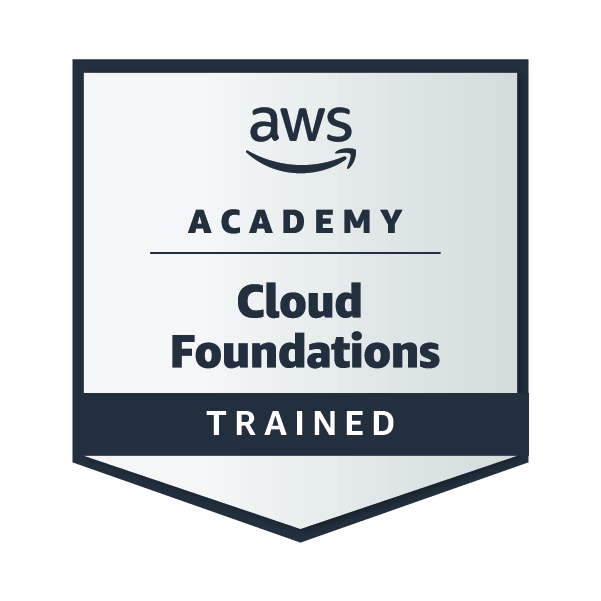

# ¡Marcelo!

## Sobre mí

- **Rol:** Técnico en Computación (CPU, notebooks, tablets y celulares) y estudiante de Desarrollo de Software en el IFTS N.º 29.
- **Ubicación:** Barracas, Buenos Aires, Argentina.

<h2 align="center">⚡ Tech Stack</h2>
 

<imgs://skillicons.dev/icons?i=html,css,js 

 

  <h2>Insignias y certificaciones</h2>

  

  
<strong>AWS Academy Graduate - Cloud Foundations</strong>

  
Amazon Web Services Training and Certification

