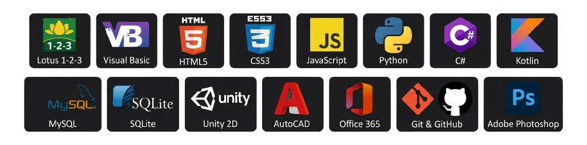

# ¡Marcelo!

## Sobre mí

- **Rol:** Técnico en Computación (CPU, notebooks, tablets y celulares) y estudiante del **último año** de la carrera de Desarrollo de Software en el IFTS N.º 29.
- **Enfoque Full Stack:** Disfruto crear proyectos desde cero y abarcar ambos mundos del desarrollo. Me apasiona construir tanto la arquitectura y lógica del servidor (Back End) como diseñar y maquetar la experiencia interactiva del usuario (Front End).
- **Ubicación:** Barracas, Buenos Aires, Argentina.
- **📚 Actualmente cursando (Último año del IFTS):**
  - Desarrollo de Sistemas Web (Back End) con **Node.js**.
  - Desarrollo de Sistemas Web (Front End) con **React**, integración de APIs y testing en React.
  - Ingeniería de Software.
  - Desarrollo e Implementación de Sistemas en la Nube (**AWS**).
- **🚀 Formación adicional:**
  - Curso de Frontend con **JavaScript** (extracurricular, enfocado en reforzar saberes base para dominar mejor React).

  <h2>Habilidades y tecnologías</h2>
  
  
  

 

  <h2>Insignias y certificaciones</h2>

  

  
<strong>AWS Academy Graduate - Cloud Foundations</strong>

  
Amazon Web Services Training and Certification

